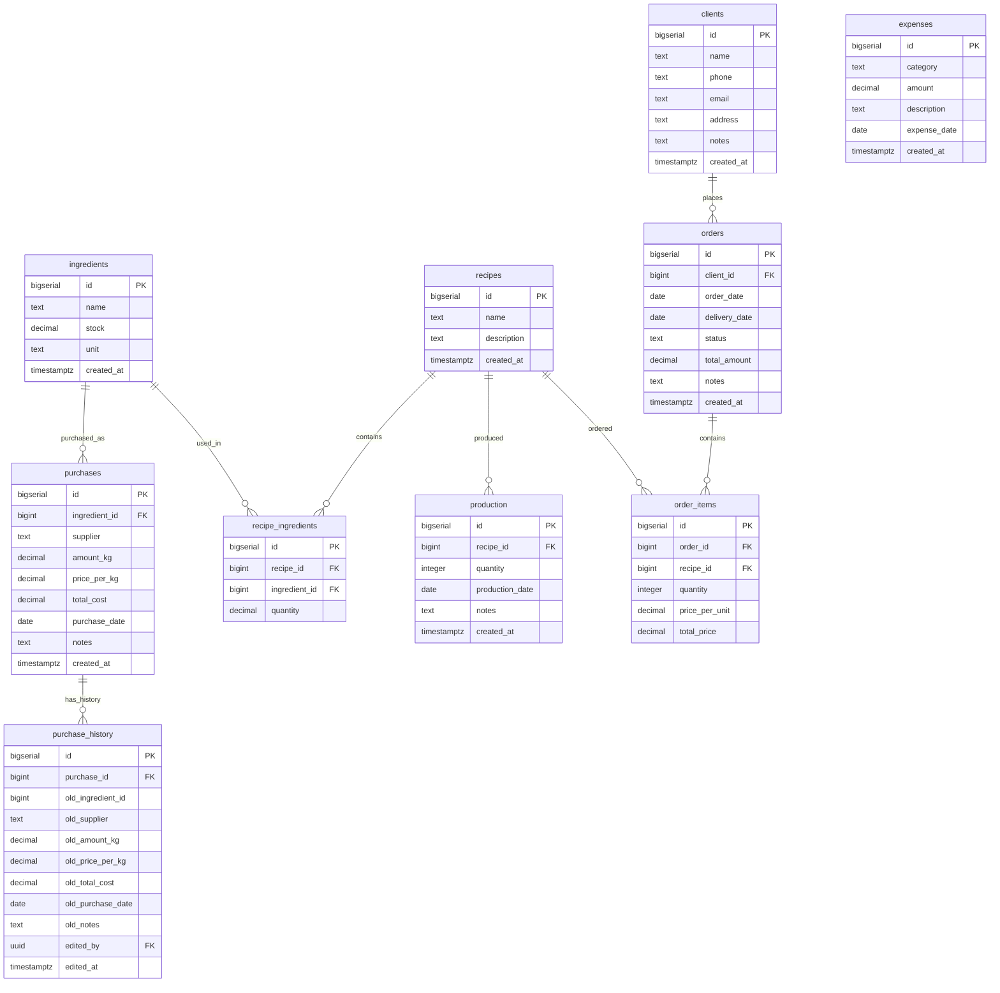

# Database Schema

## Overview

The CRM uses Supabase (PostgreSQL) with Row-Level Security (RLS) enabled. Schema location: `supabase/schema.sql`

## Entity Relationship Diagram



## Tables

### Core Entities

#### ingredients
Inventory items used in recipes.

| Column | Type | Constraints | Description |
|--------|------|-------------|-------------|
| id | bigserial | PRIMARY KEY | Auto-increment ID |
| name | text | NOT NULL | Ingredient name (e.g., "Мука высшего сорта") |
| stock | decimal(10,2) | NOT NULL, DEFAULT 0, CHECK >= 0 | Current stock in kg |
| unit | text | NOT NULL, DEFAULT 'кг' | Measurement unit |
| created_at | timestamptz | DEFAULT now() | Record creation time |

**Indexes**: None (small table, < 1000 rows expected)

#### purchases
Records of ingredient purchases from suppliers.

| Column | Type | Constraints | Description |
|--------|------|-------------|-------------|
| id | bigserial | PRIMARY KEY | Auto-increment ID |
| ingredient_id | bigint | NOT NULL, FK → ingredients(id) ON DELETE CASCADE | Which ingredient was purchased |
| supplier | text | NOT NULL | Supplier name |
| amount_kg | decimal(10,2) | NOT NULL, CHECK > 0 | Purchase quantity in kg |
| price_per_kg | decimal(10,2) | NOT NULL, CHECK > 0 | Price per kilogram |
| total_cost | decimal(10,2) | NOT NULL, CHECK > 0 | Total purchase cost |
| purchase_date | date | NOT NULL | Date of purchase |
| notes | text | NULL | Optional notes |
| created_at | timestamptz | DEFAULT now() | Record creation time |

**Indexes**: `ingredient_id` (foreign key)

**Stock sync**: When purchase created, ingredient stock increases by `amount_kg`

#### purchase_history
Audit trail for purchase modifications.

| Column | Type | Constraints | Description |
|--------|------|-------------|-------------|
| id | bigserial | PRIMARY KEY | Auto-increment ID |
| purchase_id | bigint | NOT NULL, FK → purchases(id) ON DELETE CASCADE | Which purchase was edited |
| old_ingredient_id | bigint | NULL | Ingredient before edit (no FK) |
| old_supplier | text | NULL | Supplier before edit |
| old_amount_kg | decimal(10,2) | NULL | Amount before edit |
| old_price_per_kg | decimal(10,2) | NULL | Price before edit |
| old_total_cost | decimal(10,2) | NULL | Total cost before edit |
| old_purchase_date | date | NULL | Date before edit |
| old_notes | text | NULL | Notes before edit |
| edited_by | uuid | FK → auth.users(id) ON DELETE SET NULL | User who made edit |
| edited_at | timestamptz | DEFAULT now() | When edit occurred |

**Design note**: `old_ingredient_id` has no FK constraint to preserve history even after ingredient deletion.

**Cascade behavior**: History deleted when parent purchase deleted.

#### recipes
Product recipes defining ingredient composition.

| Column | Type | Constraints | Description |
|--------|------|-------------|-------------|
| id | bigserial | PRIMARY KEY | Auto-increment ID |
| name | text | NOT NULL | Recipe name (e.g., "Наполеон") |
| description | text | NULL | Optional description |
| created_at | timestamptz | DEFAULT now() | Record creation time |

#### recipe_ingredients
Junction table for many-to-many relationship between recipes and ingredients.

| Column | Type | Constraints | Description |
|--------|------|-------------|-------------|
| id | bigserial | PRIMARY KEY | Auto-increment ID |
| recipe_id | bigint | NOT NULL, FK → recipes(id) ON DELETE CASCADE | Recipe reference |
| ingredient_id | bigint | NOT NULL, FK → ingredients(id) ON DELETE CASCADE | Ingredient reference |
| quantity | decimal(10,2) | NOT NULL, CHECK > 0 | Amount needed in kg |

**Indexes**: `recipe_id`, `ingredient_id` (foreign keys)

**Unique constraint**: `(recipe_id, ingredient_id)` - one ingredient per recipe only once

#### production
Production batches of recipes.

| Column | Type | Constraints | Description |
|--------|------|-------------|-------------|
| id | bigserial | PRIMARY KEY | Auto-increment ID |
| recipe_id | bigint | NOT NULL, FK → recipes(id) ON DELETE CASCADE | What was produced |
| quantity | integer | NOT NULL, CHECK > 0 | How many units produced |
| production_date | date | NOT NULL | Date of production |
| notes | text | NULL | Optional notes |
| created_at | timestamptz | DEFAULT now() | Record creation time |

**Stock sync**: When production created, ingredient stock decreases by `quantity * recipe_ingredient.quantity` for each ingredient in recipe.

#### clients
Customer contact information.

| Column | Type | Constraints | Description |
|--------|------|-------------|-------------|
| id | bigserial | PRIMARY KEY | Auto-increment ID |
| name | text | NOT NULL | Client name |
| phone | text | NULL | Phone number |
| email | text | NULL | Email address |
| address | text | NULL | Delivery address |
| notes | text | NULL | Optional notes |
| created_at | timestamptz | DEFAULT now() | Record creation time |

#### orders
Customer orders for products.

| Column | Type | Constraints | Description |
|--------|------|-------------|-------------|
| id | bigserial | PRIMARY KEY | Auto-increment ID |
| client_id | bigint | NOT NULL, FK → clients(id) ON DELETE CASCADE | Which client ordered |
| order_date | date | NOT NULL | Order placement date |
| delivery_date | date | NULL | Expected/actual delivery date |
| status | text | NOT NULL, DEFAULT 'новый' | Order status (новый, в работе, готов, доставлен, отменен) |
| total_amount | decimal(10,2) | NOT NULL, DEFAULT 0, CHECK >= 0 | Total order cost |
| notes | text | NULL | Optional notes |
| created_at | timestamptz | DEFAULT now() | Record creation time |

**Indexes**: `client_id` (foreign key), `status` (for filtering)

#### order_items
Line items within an order.

| Column | Type | Constraints | Description |
|--------|------|-------------|-------------|
| id | bigserial | PRIMARY KEY | Auto-increment ID |
| order_id | bigint | NOT NULL, FK → orders(id) ON DELETE CASCADE | Which order |
| recipe_id | bigint | NOT NULL, FK → recipes(id) ON DELETE CASCADE | Which product |
| quantity | integer | NOT NULL, CHECK > 0 | How many units |
| price_per_unit | decimal(10,2) | NOT NULL, CHECK >= 0 | Price per unit |
| total_price | decimal(10,2) | NOT NULL, CHECK >= 0 | Line total (quantity * price_per_unit) |

**Indexes**: `order_id`, `recipe_id` (foreign keys)

#### expenses
Business expenses (advertising, delivery, utilities, etc).

| Column | Type | Constraints | Description |
|--------|------|-------------|-------------|
| id | bigserial | PRIMARY KEY | Auto-increment ID |
| category | text | NOT NULL | Expense category (реклама, доставка, коммунальные, прочее) |
| amount | decimal(10,2) | NOT NULL, CHECK > 0 | Expense amount |
| description | text | NOT NULL | Expense description |
| expense_date | date | NOT NULL | Date of expense |
| created_at | timestamptz | DEFAULT now() | Record creation time |

**Indexes**: `category`, `expense_date` (for filtering and reporting)

## Row-Level Security (RLS)

All tables have RLS enabled with policies allowing authenticated users full CRUD access:

```sql
ALTER TABLE [table_name] ENABLE ROW LEVEL SECURITY;

CREATE POLICY "Users can select [table_name]"
  ON [table_name] FOR SELECT
  USING (true);

CREATE POLICY "Users can insert [table_name]"
  ON [table_name] FOR INSERT
  WITH CHECK (true);

CREATE POLICY "Users can update [table_name]"
  ON [table_name] FOR UPDATE
  USING (true)
  WITH CHECK (true);

CREATE POLICY "Users can delete [table_name]"
  ON [table_name] FOR DELETE
  USING (true);
```

**Security note**: Current MVP assumes single-tenant (all authenticated users have full access). Future multi-tenant support will require more granular RLS policies.

## Functions (RPC)

### update_purchase()

**Location**: `supabase/schema.sql:182`

**Purpose**: Atomically update purchase record, save history snapshot, and adjust ingredient stock.

**Signature**:
```sql
CREATE OR REPLACE FUNCTION update_purchase(
  p_id BIGINT,
  p_ingredient_id BIGINT,
  p_supplier TEXT,
  p_amount_kg DECIMAL,
  p_price_per_kg DECIMAL,
  p_total_cost DECIMAL,
  p_purchase_date DATE,
  p_notes TEXT,
  p_edited_by UUID
)
RETURNS void
LANGUAGE plpgsql
SECURITY DEFINER
```

**Transaction steps**:
1. Save old values to `purchase_history`
2. Reverse old ingredient stock adjustment
3. Apply new ingredient stock adjustment
4. Update purchase record

**Security**: Runs with SECURITY DEFINER to allow cross-table updates, but verifies user has UPDATE permission on purchases first.

## Data Flow Patterns

### Purchase Creation
```
User submits form
  → createPurchase() server action
  → Supabase INSERT into purchases
  → Trigger increases ingredients.stock
  → revalidatePath('/purchases')
  → Page refreshes with new data
```

### Purchase Edit
```
User submits edit form
  → updatePurchase() server action
  → Supabase RPC update_purchase()
  → BEGIN TRANSACTION
    → INSERT into purchase_history (snapshot)
    → UPDATE ingredients (reverse old stock)
    → UPDATE ingredients (apply new stock)
    → UPDATE purchases (new values)
  → COMMIT
  → revalidatePath('/purchases')
  → Page refreshes
```

### Production Creation
```
User submits form
  → createProduction() server action
  → Supabase INSERT into production
  → For each ingredient in recipe:
    → UPDATE ingredients SET stock = stock - (quantity * recipe_quantity)
  → revalidatePath('/production')
  → Page refreshes
```

## Constraints and Validation

### Check Constraints
- All amount/price fields: `CHECK (column > 0)`
- Stock: `CHECK (stock >= 0)` - prevents negative inventory
- Total amounts: `CHECK (column >= 0)` - allows zero for empty orders

### Foreign Key Cascade Behavior

| Parent | Child | On Delete |
|--------|-------|-----------|
| ingredients | purchases | CASCADE |
| ingredients | recipe_ingredients | CASCADE |
| recipes | recipe_ingredients | CASCADE |
| recipes | production | CASCADE |
| recipes | order_items | CASCADE |
| clients | orders | CASCADE |
| orders | order_items | CASCADE |
| purchases | purchase_history | CASCADE |
| auth.users | purchase_history.edited_by | SET NULL |

**Design rationale**:
- Most relationships: CASCADE (deleting parent removes children)
- `edited_by`: SET NULL (preserve history even if user deleted)
- `old_ingredient_id`: No FK (preserve history even if ingredient deleted)

## Indexes

Currently relying on PostgreSQL's automatic indexes on:
- Primary keys
- Foreign key columns

**Future optimization**: If performance issues arise with large datasets, consider adding indexes on:
- `purchases.purchase_date` (for date range queries)
- `orders.status` (for order filtering)
- `production.production_date` (for reporting)
- `expenses.expense_date` (for financial reports)

## Migrations

Schema managed via SQL file: `supabase/schema.sql`

**Migration strategy** (for future):
1. Create versioned migration files: `migrations/001_add_feature.sql`
2. Apply via Supabase CLI: `supabase migration up`
3. Keep schema.sql as source of truth (regenerate from migrations)

## Related Documentation

- [Purchase Edit with History Feature](../features/purchase-edit-with-history.md)
- [ADR 002: Purchase Edit History Architecture](../decisions/002-purchase-edit-history-architecture.md)
- Supabase schema file: `supabase/schema.sql`
