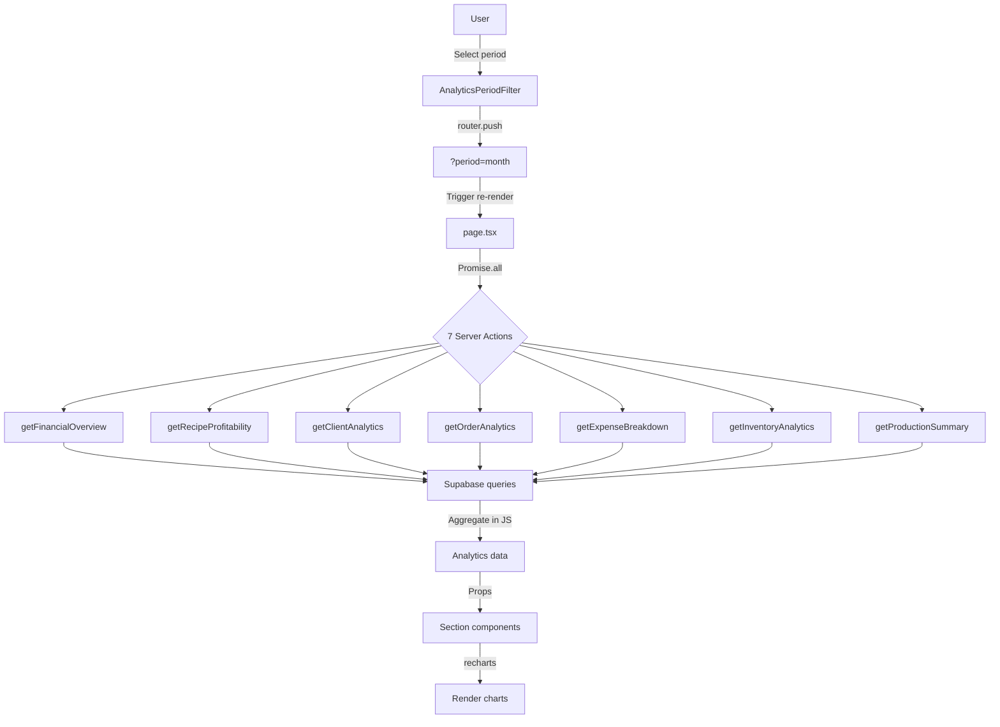

# Analytics Page
Date: 2026-02-13 | Status: Implemented

## Overview

A comprehensive analytics dashboard at `/analytics` with 6 tabbed sections covering financial performance, recipe profitability, client behavior, order statistics, expense breakdown, and inventory valuation. Features URL-based period filtering (week, month, quarter, year, all-time), recharts visualizations, and parallel data fetching for optimal performance.

## Key Features

### 1. Period Filtering
- **URL-based state**: Period selection via `?period=` search param triggers server-side re-render
- **5 time ranges**: Неделя (week), Месяц (month), Квартал (quarter), Год (year), Все время (all)
- **Default**: Month
- **Scope**: Applies to all sections except Recipe Profitability and Inventory (all-time only)

### 2. Six Analytics Sections

#### Финансы (Financial Overview)
- **7 KPI cards**: Доходы, Закупки, Прочие расходы, Потери, Прибыль, Заказов выдано, Средний чек
- **Monthly bar chart**: Last 6 months of revenue, expenses, and profit side-by-side
- **Profit formula**: `revenue - purchaseExpenses - otherExpenses - writeOffLosses`
- **Data source**: Delivered orders, purchases, expenses, write-offs

#### Рентабельность (Recipe Profitability)
- **Margin table**: Recipe name, selling price, ingredient cost, margin (₽), margin (%)
- **Margin bar chart**: Top recipes by margin percentage
- **All-time scope**: Not affected by period filter
- **Sort**: By total revenue (best-sellers first)
- **Cost calculation**: Uses latest purchase price per ingredient

#### Клиенты (Client Analytics)
- **3 summary cards**: Всего клиентов, Активных клиентов (with orders), Средний чек
- **Client ranking table**: Name, total revenue, order count, avg order value
- **Revenue bar chart**: Top clients by total revenue
- **Active filter**: Only counts clients with delivered orders in period

#### Заказы (Order Analytics)
- **5 summary cards**: Всего заказов, Выдано, Средний чек, Максимальный чек, (status pie chart)
- **Status distribution pie chart**: Order count by status with percentages
- **Top 10 recipes table**: Most ordered recipes by revenue
- **Status colors**: Uses `ORDER_STATUS_BADGE_VARIANT` for consistent styling

#### Расходы (Expense Breakdown)
- **Total expense card**: Общие расходы
- **Category pie chart**: Expenses by category (Реклама, Доставка, Прочее)
- **Category table**: Category, total amount, count, percentage
- **Sort**: By total amount (highest first)

#### Склад (Inventory Analytics)
- **4 summary cards**: Стоимость остатков, Позиций в наличии, Мало на складе (<100), Нет в наличии (≤0)
- **Stock value bar chart**: Top ingredients by current stock value
- **Valuation**: Uses `stock_qty * lastPurchasePrice`
- **All-time scope**: Not affected by period filter

### 3. Visualization

All charts use **recharts** via **shadcn/ui chart wrapper** (`ChartContainer`, `ChartTooltip`) for:
- Consistent theming with shadcn design system
- Responsive sizing
- Accessible tooltips
- CSS variable-based colors

Chart types:
- **Bar charts**: Financial trends, recipe margins, client revenue, inventory value
- **Pie charts**: Status distribution, expense categories

### 4. Performance Optimization

- **Parallel fetching**: All 7 server actions called via `Promise.all()` in page orchestrator
- **Client-side sections**: Section components are `'use client'` for recharts rendering
- **Server-side page**: Page component is Server Component, fetches data in parallel before rendering
- **No over-fetching**: Each action returns only necessary data (no full entity hydration)

## Architecture

### Component Structure

```
src/app/(dashboard)/analytics/
├── page.tsx                             # Server Component, orchestrator
├── loading.tsx                          # Skeleton loading state
├── analytics-period-filter.tsx          # Period filter (Client Component)
├── analytics-tabs.tsx                   # Tab navigation (Client Component)
└── sections/
    ├── financial-overview.tsx           # Financial KPIs + bar chart
    ├── recipe-profitability.tsx         # Margin table + bar chart
    ├── client-analytics.tsx             # Client rankings + bar chart
    ├── order-analytics.tsx              # Status pie + top recipes table
    ├── expense-breakdown.tsx            # Category pie + table
    └── inventory-analytics.tsx          # Stock value chart + table

src/lib/actions/
└── analytics.ts                         # 7 server actions

src/lib/
├── types.ts                             # Analytics types
├── constants.ts                         # ORDER_STATUSES (reused)
└── navigation.ts                        # Analytics nav item
```

### Data Flow



### Key Technical Decisions

#### URL State vs. Client State
- **Decision**: Use `searchParams` for period filter instead of React state
- **Rationale**:
  - Server-side rendering with fresh data on period change
  - Shareable URLs for specific time ranges
  - Browser back/forward navigation works
  - No client-side caching issues
- **Trade-off**: Slightly slower than pure client-side filter (acceptable for analytics)

#### JavaScript Aggregation vs. Database Views
- **Decision**: Fetch raw data from Supabase, aggregate in server actions using JS
- **Rationale**:
  - Single-user app, data volume is manageable
  - No need for complex SQL or database views
  - Easier to debug and modify aggregation logic
  - Supabase free tier doesn't support custom functions easily
- **Performance**: Acceptable for confectionery business scale (<10k orders)

#### 6 Separate Actions vs. 1 Monolithic Function
- **Decision**: Split analytics into 7 independent server actions
- **Benefits**:
  - Parallel execution via `Promise.all()`
  - Reusable actions (e.g., `getRecipeProfitability` could be used elsewhere)
  - Smaller code units, easier to test and maintain
  - Clear TypeScript types per action
- **Trade-off**: More files, but better architecture

#### Client Components for Sections
- **Decision**: All section components marked `'use client'`
- **Rationale**: recharts requires browser APIs (DOM, canvas) for rendering
- **Optimization**: Data fetching still happens on server, only visualization is client-side

#### recharts + shadcn Chart Wrapper
- **Decision**: Use `recharts` library with shadcn `ChartContainer` wrapper
- **Benefits**:
  - Declarative API for bar/pie charts
  - shadcn wrapper provides consistent theming via CSS variables
  - Accessible tooltips (`ChartTooltip`, `ChartTooltipContent`)
  - Responsive by default (`ResponsiveContainer`)
- **Alternative considered**: Victory charts (heavier), Chart.js (imperative API)

### Server Actions in Detail

#### getFinancialOverview
```typescript
// src/lib/actions/analytics.ts:47-204
export async function getFinancialOverview(period: AnalyticsPeriod): Promise<FinancialOverview>
```
**Logic**:
1. Calculate date filter based on period (week → -7 days, month → -1 month, etc.)
2. Query 4 tables in parallel: `purchases`, `orders` (status=delivered), `expenses`, `write_offs`
3. Sum totals for each category
4. Calculate profit: `revenue - all expenses`
5. Query last 6 months of data for monthly breakdown
6. Aggregate by month key (`YYYY-MM`) using Map, compute profit per month
7. Return totals + `monthlyBreakdown` array

**Monthly aggregation**:
```typescript
const monthlyMap = new Map<string, MonthlyBreakdown>()
// ... add revenue, expenses to each month bucket
monthlyBreakdown.sort((a, b) => a.month.localeCompare(b.month)) // Chronological order
```

#### getRecipeProfitability
```typescript
// src/lib/actions/analytics.ts:206-270
export async function getRecipeProfitability(): Promise<RecipeProfitabilityItem[]>
```
**Logic**:
1. Fetch all recipes with nested `recipe_items`
2. Fetch all purchases, order by date desc (latest price per ingredient)
3. Fetch all delivered order items
4. Build `latestPriceMap` (ingredient_id → price_per_unit)
5. For each recipe:
   - Sum ingredient costs: `Σ(quantity * latestPrice)`
   - Calculate margin: `sellingPrice - ingredientCost`
   - Calculate margin %: `(margin / sellingPrice) * 100`
   - Count total ordered quantity and revenue from order_items
6. Sort by `totalRevenue` desc (best-sellers first)

**Cost calculation**:
```typescript
const ingredientCost = recipe.recipe_items.reduce((sum, item) => {
  const pricePerUnit = latestPriceMap.get(item.ingredient_id) ?? 0
  return sum + item.quantity * pricePerUnit
}, 0)
```

#### getClientAnalytics
```typescript
// src/lib/actions/analytics.ts:272-338
export async function getClientAnalytics(period: AnalyticsPeriod): Promise<ClientAnalyticsData>
```
**Logic**:
1. Query orders with nested `clients`, filter by period and status=delivered
2. Query all clients to get total count
3. Aggregate orders by `client_id`: sum revenue, count orders
4. Calculate `avgOrderValue` per client: `totalRevenue / orderCount`
5. Sort clients by `totalRevenue` desc
6. Return client rankings + `totalClients`, `activeClients`

#### getOrderAnalytics
```typescript
// src/lib/actions/analytics.ts:340-435
export async function getOrderAnalytics(period: AnalyticsPeriod): Promise<OrderAnalyticsData>
```
**Logic**:
1. Query all orders with nested `order_items` + `recipes`, filter by period
2. Aggregate by status: count, sum total_price
3. Calculate status percentages: `(count / totalOrders) * 100`
4. Aggregate by recipe: sum quantity, sum revenue
5. Return top 10 recipes by revenue
6. Compute `avgOrderValue` (delivered only), `maxOrderValue`

**Status distribution**:
```typescript
const statusDistribution = Array.from(statusMap.entries()).map(([status, stats]) => {
  const statusLabel = ORDER_STATUSES.find(s => s.value === status)?.label ?? status
  return { status, label: statusLabel, count, total, percentage }
})
```

#### getExpenseBreakdown
```typescript
// src/lib/actions/analytics.ts:437-481
export async function getExpenseBreakdown(period: AnalyticsPeriod): Promise<ExpenseBreakdownData>
```
**Logic**:
1. Query expenses, filter by period
2. Aggregate by category: sum amount, count entries
3. Calculate percentages: `(categoryTotal / totalExpenses) * 100`
4. Sort by total desc

#### getInventoryAnalytics
```typescript
// src/lib/actions/analytics.ts:483-544
export async function getInventoryAnalytics(): Promise<InventoryAnalyticsData>
```
**Logic**:
1. Fetch all ingredients with `stock_qty`
2. Fetch all purchases, order by date desc (latest price per ingredient)
3. Build `latestPriceMap`
4. For each ingredient:
   - Calculate `stockValue = stock_qty * lastPurchasePrice`
   - Count as low stock if `stock_qty < 100`
   - Count as out of stock if `stock_qty <= 0`
5. Sort by `stockValue` desc
6. Return `totalStockValue`, `ingredients`, counts

**Stock status thresholds**:
```typescript
if (stockQty <= 0) {
  outOfStockCount += 1
} else if (stockQty < 100) {
  lowStockCount += 1  // Hardcoded threshold
}
```

#### getProductionSummary
```typescript
// src/lib/actions/analytics.ts:546-604
export async function getProductionSummary(period: AnalyticsPeriod): Promise<ProductionSummaryItem[]>
```
**Logic**:
1. Query production records with nested `recipes`, filter by period
2. Aggregate by `recipe_id`: count production runs, sum quantity, sum total_cost
3. Sort by `totalCost` desc (most expensive recipes first)

## Types

All analytics types defined in `src/lib/types.ts:154-262`:

```typescript
// Period filter
export type AnalyticsPeriod = 'week' | 'month' | 'quarter' | 'year' | 'all'

// Financial Overview
export type MonthlyBreakdown = {
  month: string           // 'YYYY-MM'
  monthLabel: string      // 'Янв', 'Фев', ...
  revenue: number
  purchaseExpenses: number
  otherExpenses: number
  writeOffLosses: number
  profit: number
}

export type FinancialOverview = {
  revenue: number
  purchaseExpenses: number
  otherExpenses: number
  writeOffLosses: number
  profit: number
  orderCount: number
  avgOrderValue: number
  monthlyBreakdown: MonthlyBreakdown[]
}

// Recipe Profitability
export type RecipeProfitabilityItem = {
  recipeId: string
  name: string
  sellingPrice: number | null
  ingredientCost: number
  margin: number | null
  marginPercent: number | null
  totalOrdered: number
  totalRevenue: number
}

// Client Analytics
export type ClientAnalyticsItem = {
  clientId: string
  name: string
  totalRevenue: number
  orderCount: number
  avgOrderValue: number
}

export type ClientAnalyticsData = {
  clients: ClientAnalyticsItem[]
  totalClients: number
  activeClients: number
}

// Order Analytics
export type OrderStatusDistribution = {
  status: string
  label: string
  count: number
  total: number
  percentage: number
}

export type TopRecipeItem = {
  recipeId: string
  name: string
  quantity: number
  revenue: number
}

export type OrderAnalyticsData = {
  statusDistribution: OrderStatusDistribution[]
  totalOrders: number
  deliveredOrders: number
  avgOrderValue: number
  maxOrderValue: number
  topRecipes: TopRecipeItem[]
}

// Expense Breakdown
export type ExpenseCategoryItem = {
  category: string
  total: number
  count: number
  percentage: number
}

export type ExpenseBreakdownData = {
  categories: ExpenseCategoryItem[]
  totalExpenses: number
}

// Inventory Analytics
export type InventoryValueItem = {
  id: string
  name: string
  unit: string
  stockQty: number
  lastPurchasePrice: number | null
  stockValue: number | null
}

export type InventoryAnalyticsData = {
  totalStockValue: number
  ingredients: InventoryValueItem[]
  lowStockCount: number
  outOfStockCount: number
}

// Production Summary
export type ProductionSummaryItem = {
  recipeId: string
  recipeName: string
  productionCount: number
  totalQuantity: number
  totalCost: number
}
```

## Code References

### Created Files

| File | Lines | Purpose |
|------|-------|---------|
| `src/lib/actions/analytics.ts` | 1-604 | 7 server actions for analytics data |
| `src/app/(dashboard)/analytics/page.tsx` | 1-50 | Server Component orchestrator |
| `src/app/(dashboard)/analytics/loading.tsx` | 1-25 | Skeleton loading state |
| `src/app/(dashboard)/analytics/analytics-period-filter.tsx` | 1-48 | Period filter dropdown (Client) |
| `src/app/(dashboard)/analytics/analytics-tabs.tsx` | 1-41 | Tab navigation (Client) |
| `src/app/(dashboard)/analytics/sections/financial-overview.tsx` | 1-192 | Financial KPIs + bar chart |
| `src/app/(dashboard)/analytics/sections/recipe-profitability.tsx` | 1-143 | Margin table + bar chart |
| `src/app/(dashboard)/analytics/sections/client-analytics.tsx` | 1-161 | Client rankings + bar chart |
| `src/app/(dashboard)/analytics/sections/order-analytics.tsx` | 1-231 | Status pie + top recipes table |
| `src/app/(dashboard)/analytics/sections/expense-breakdown.tsx` | 1-143 | Category pie + table |
| `src/app/(dashboard)/analytics/sections/inventory-analytics.tsx` | 1-167 | Stock value chart + table |

### Modified Files

| File | Change | Purpose |
|------|--------|---------|
| `src/lib/types.ts` | Added lines 154-262 | Analytics type definitions |
| `src/lib/navigation.ts` | Added analytics nav item | Sidebar link with BarChart3 icon |
| `src/lib/actions/orders.ts` | Added `revalidatePath('/analytics')` | Invalidate cache on order changes |
| `src/lib/actions/purchases.ts` | Added `revalidatePath('/analytics')` | Invalidate cache on purchase changes |
| `src/lib/actions/expenses.ts` | Added `revalidatePath('/analytics')` | Invalidate cache on expense changes |
| `src/lib/actions/production.ts` | Added `revalidatePath('/analytics')` | Invalidate cache on production changes |
| `src/lib/actions/write-offs.ts` | Added `revalidatePath('/analytics')` | Invalidate cache on write-off changes |

## User Workflows

### View Financial Performance
1. Navigate to "Аналитика" from sidebar
2. Default view: Финансы tab, Месяц period
3. See 7 KPI cards: revenue, expenses breakdown, profit, order stats
4. Scroll to monthly bar chart for 6-month trend
5. Change period filter to compare time ranges

### Analyze Recipe Margins
1. Switch to "Рентабельность" tab
2. Review table: identify high-margin vs. low-margin recipes
3. Look at bar chart for visual comparison of margins
4. Sort mentally by total revenue (best-sellers are at top)
5. Use insights to adjust pricing or promote profitable recipes

### Identify Top Clients
1. Switch to "Клиенты" tab
2. Check summary cards: total vs. active clients, average order value
3. Review ranking table: top clients by total revenue
4. Identify VIP clients for special offers or retention efforts
5. Change period to see seasonal client activity

### Track Order Pipeline
1. Switch to "Заказы" tab
2. Review summary cards: total orders, delivered count, avg/max order values
3. Check status distribution pie chart: identify bottlenecks (too many "В работе"?)
4. Review top 10 recipes table: understand product demand
5. Use insights for inventory planning

### Audit Expenses
1. Switch to "Расходы" tab
2. Check total expenses card
3. Review category pie chart: which category dominates?
4. Look at category table for detailed breakdown
5. Identify opportunities to reduce costs in high-spend categories

### Monitor Inventory Value
1. Switch to "Склад" tab
2. Check summary cards: total stock value, low/out-of-stock counts
3. Review stock value bar chart: which ingredients tie up most capital?
4. Scroll through table for detailed view of all ingredients
5. Plan purchases based on stock status and value

## Database Impact

No schema changes. Uses existing tables:
- `orders`, `order_items` (revenue, order analytics)
- `purchases` (purchase expenses, latest ingredient prices, inventory valuation)
- `expenses` (other expenses, category breakdown)
- `write_offs` (losses, inventory)
- `recipes`, `recipe_items` (recipe costs, profitability)
- `clients` (client analytics)
- `ingredients` (inventory, stock quantities)
- `production`, `production_items` (production summary)

## Performance Considerations

### Query Optimization
- All actions use `.eq('user_id', user.id)` for RLS filtering
- Date filtering at database level: `.gte('date', dateFrom)` reduces result set
- Status filtering for delivered orders: `.eq('status', 'delivered')`
- Parallel queries via `Promise.all()` minimize total latency

### Aggregation Cost
- JS-side aggregation acceptable for single-user app
- Map-based grouping (`clientStatsMap`, `recipeStatsMap`) is O(n)
- Sorting at the end is O(n log n), acceptable for small datasets

### Client-Side Rendering
- Section components are client-only (recharts requirement)
- Data is pre-computed on server, client only renders charts
- No client-side data fetching or state management

### Caching Strategy
- All analytics queries are fresh on page load
- `revalidatePath('/analytics')` in mutation actions ensures stale data is purged
- No aggressive caching (acceptable trade-off for accurate analytics)

## Related Documentation

- [Database Schema](../architecture/database-schema.md) — Tables used by analytics queries
- [Dashboard Redesign](./dashboard-redesign.md) — Uses same ORDER_STATUS_BADGE_VARIANT constant
- [Orders Kanban View](./orders-kanban-edit.md) — ORDER_STATUSES constant reused for status labels
- [Order Form Enhancements](./order-form-enhancements.md) — Nullable recipe price affects margin calculation

## Future Enhancements

### Data Export
- CSV/Excel export for all analytics tables
- PDF report generation with charts

### Advanced Filtering
- Date range picker (custom start/end dates)
- Multi-select filters (e.g., specific clients, recipes, categories)
- Compare two periods side-by-side

### Additional Metrics
- Revenue per ingredient (which ingredients drive most sales?)
- Production efficiency (cost per unit over time)
- Client lifetime value (LTV)
- Churn rate (inactive clients)
- Profit per recipe (including production costs, not just ingredient costs)

### Forecasting
- Trend lines for revenue/profit
- Seasonal patterns (peak months)
- Inventory reorder alerts based on usage trends

### Alerts & Goals
- KPI thresholds (e.g., alert if profit < target)
- Monthly/weekly goal tracking
- Automated email reports

### Performance Improvements
- Database materialized views for pre-aggregated data (if data volume grows)
- Redis caching for expensive queries
- Incremental loading for large charts (pagination)

## Known Limitations

1. **Hardcoded stock thresholds**: Low stock defined as `< 100`, out-of-stock as `≤ 0` (no user configuration)
2. **No production in orders analytics**: Production summary is in separate tab, not integrated with order flow
3. **All-time recipe profitability**: Cannot filter recipe profitability by period (always shows all-time totals)
4. **No drill-down**: Cannot click a chart segment to view underlying records (e.g., click "Новый" status to see those orders)
5. **No real-time updates**: Requires manual page refresh to see latest data
6. **Single currency**: All amounts in ₽ (rubles), no multi-currency support
7. **No data validation warnings**: If purchases or recipe_items are missing, cost calculations may be inaccurate (no warnings shown)
