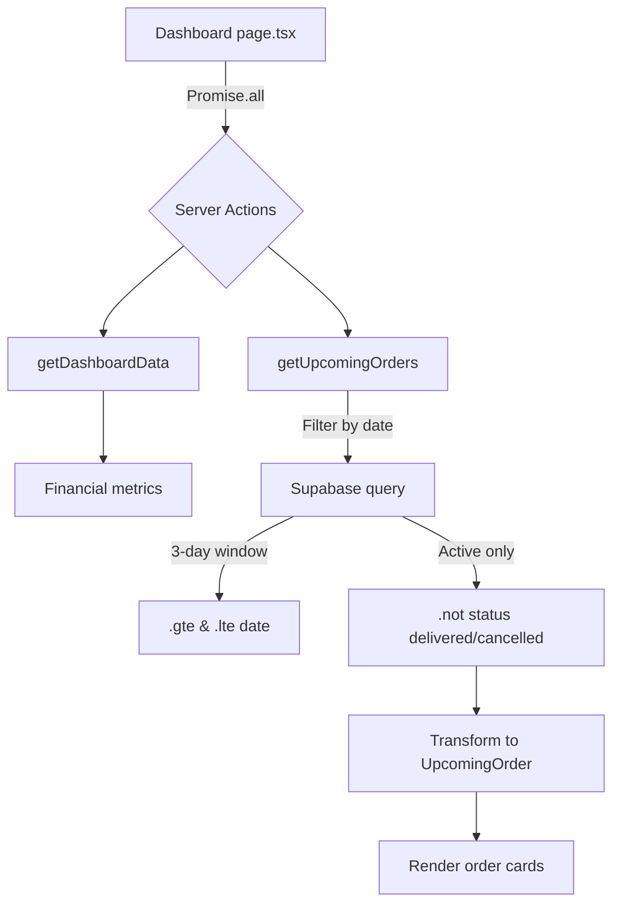

# Dashboard Redesign
Date: 2026-02-13 | Status: Implemented

## Overview

The dashboard page was redesigned to prioritize operational tasks over inventory monitoring. The inventory stock table was removed and replaced with quick action buttons and an upcoming orders section, transforming the dashboard into a command center for daily operations.

## Key Features

### 1. Quick Action Buttons
- **4 primary actions**: Новый заказ, Добавить закупку, Добавить расход, Добавить списание
- Icon-based design with lucide-react icons (ClipboardList, ShoppingCart, Receipt, Trash2)
- Direct navigation to existing pages via Next.js `Link` components
- No dialog modals — keeps dashboard lightweight and fast

### 2. Upcoming Orders Section
- **3-day window**: Shows orders for today, tomorrow, and day after tomorrow
- **Status filtering**: Only shows active orders (new, in_progress, ready) — excludes delivered and cancelled
- **Organized by date**: Three columns with clear labels (Сегодня, Завтра, Послезавтра)
- **Order cards**: Display client name, items summary, price, and status badge with color coding

### 3. Financial Metrics (unchanged)
- Monthly summary cards: purchases, other expenses, write-off losses, revenue, profit
- Still fetched via existing `getDashboardData()` function

## Architecture

### Component Structure

```
src/app/(dashboard)/
└── page.tsx                       # Server Component, renders dashboard

src/lib/actions/
└── dashboard.ts                   # Server actions: getDashboardData, getUpcomingOrders

src/lib/
├── types.ts                       # Added UpcomingOrder type
└── constants.ts                   # Added ORDER_STATUS_BADGE_VARIANT
```

### Data Flow



### Key Technical Decisions

#### Remove Inventory Table
- **Rationale**: Dashboard is operational, not monitoring — users don't need full inventory list on landing page
- **Impact**: Removed `ingredients` query from `getDashboardData()`, reducing dashboard load time
- **Alternative**: Users access full inventory via `/inventory` sidebar link

#### Link Navigation vs. Dialogs
- **Decision**: Quick action buttons use `<Link href="/orders">` instead of opening dialogs
- **Rationale**:
  - Keeps dashboard code simple (pure Server Component)
  - Forms already exist on respective pages
  - Avoids duplicate form logic
  - Better UX for complex multi-step forms (orders with items)

#### 3-Day Window with DB-Level Filtering
- **Decision**: Query only 3 days of orders, filter statuses at database level
- **SQL**: `.gte('date', today)`, `.lte('date', dayAfterTomorrow)`, `.not('status', 'in', '("delivered","cancelled")')`
- **Performance**: Narrow query reduces data transfer and client-side processing
- **Assumption**: Most relevant operational view for confectionery business (short lead times)

#### Narrow UpcomingOrder Type
- **Decision**: Create dashboard-specific type instead of reusing full `Order` type
- **Shape**: Only includes `id`, `status` (3 values), `date`, `total_price`, minimal client/recipe names
- **Rationale**: Enforces data minimization, documents intent, prevents over-fetching

### Server Action: getUpcomingOrders

```typescript
// src/lib/actions/dashboard.ts:70-105
export async function getUpcomingOrders(): Promise<UpcomingOrder[]>
```

**Query logic:**
1. Calculate 3-day date range (today to day after tomorrow)
2. Query `orders` with nested `clients` and `order_items` + `recipes` relations
3. Filter: `.gte('date', todayStr).lte('date', dayAfterStr).not('status', 'in', '("delivered","cancelled")')`
4. Transform Supabase array response to single objects (Supabase returns nested relations as arrays)

**Supabase quirk handling:**
```typescript
// Supabase returns nested relations as arrays even for one-to-one
client: Array.isArray(order.client) && order.client[0] ? order.client[0] : null
```

### Types

#### UpcomingOrder
```typescript
// src/lib/types.ts:139-149
export type UpcomingOrder = {
  id: string
  status: 'new' | 'in_progress' | 'ready'  // Only active statuses
  date: string
  total_price: number
  client: { name: string } | null          // Minimal client shape
  order_items: {
    quantity: number
    recipe: { name: string } | null        // Minimal recipe shape
  }[]
}
```

#### ORDER_STATUS_BADGE_VARIANT
```typescript
// src/lib/constants.ts:11-17
export const ORDER_STATUS_BADGE_VARIANT: Record<string, 'default' | 'secondary' | 'outline' | 'destructive'> = {
  new: 'secondary',
  in_progress: 'default',
  ready: 'outline',
  delivered: 'secondary',
  cancelled: 'destructive',
}
```

## Code References

### Modified Files

1. **Dashboard Page** — `/home/nolood/general/crm/src/app/(dashboard)/page.tsx`
   - Removed inventory table section
   - Added quick action buttons (lines 80-105)
   - Added upcoming orders section with 3-column layout (lines 107-167)
   - Uses `ORDER_STATUSES` and `ORDER_STATUS_BADGE_VARIANT` for status display

2. **Dashboard Actions** — `/home/nolood/general/crm/src/lib/actions/dashboard.ts`
   - Removed ingredients query from `getDashboardData()` (no longer needed)
   - Added `getUpcomingOrders()` function (lines 70-105)
   - Added `SupabaseOrderResponse` type for query result transformation (lines 58-68)

3. **Type Definitions** — `/home/nolood/general/crm/src/lib/types.ts`
   - Added `UpcomingOrder` type (lines 139-149)

4. **Constants** — `/home/nolood/general/crm/src/lib/constants.ts`
   - Added `ORDER_STATUS_BADGE_VARIANT` map (lines 11-17)
   - Provides consistent badge styling across dashboard and orders page

## User Impact

### Before
- Dashboard showed full inventory table (could be dozens of ingredients)
- No quick actions — users navigated via sidebar
- No visibility into upcoming workload

### After
- Dashboard loads faster (no inventory table)
- One-click access to 4 most common actions
- Immediate overview of next 3 days of orders grouped by date
- Color-coded status badges for quick visual scanning

### Workflow Improvement
Creating a new order:
- **Before**: Click sidebar "Заказы" → Wait for page load → Click "Новый заказ" button
- **After**: Click dashboard "Новый заказ" button from landing page

### Operational Benefits
- Confectioners can see at-a-glance what needs to be prepared today/tomorrow
- Status badges (Новый, В работе, Готов) indicate production pipeline state
- Empty state ("Нет заказов") clearly shows no work scheduled

## Related Documentation

- [Orders Kanban View and Editing](./orders-kanban-edit.md) — Status management system
- [Database Schema](../architecture/database-schema.md) — Orders and order_items tables
- [Order Form Enhancements](./order-form-enhancements.md) — Client selection and quick dates

## Future Enhancements

Potential improvements based on user feedback:
- Configurable date range (3 days → 7 days)
- Filter by status (show only "ready" orders)
- Click order card to open edit dialog
- Badge click to quickly change status
- Sortable columns in upcoming orders
- Show production items needed for upcoming orders (ingredient checklist)
