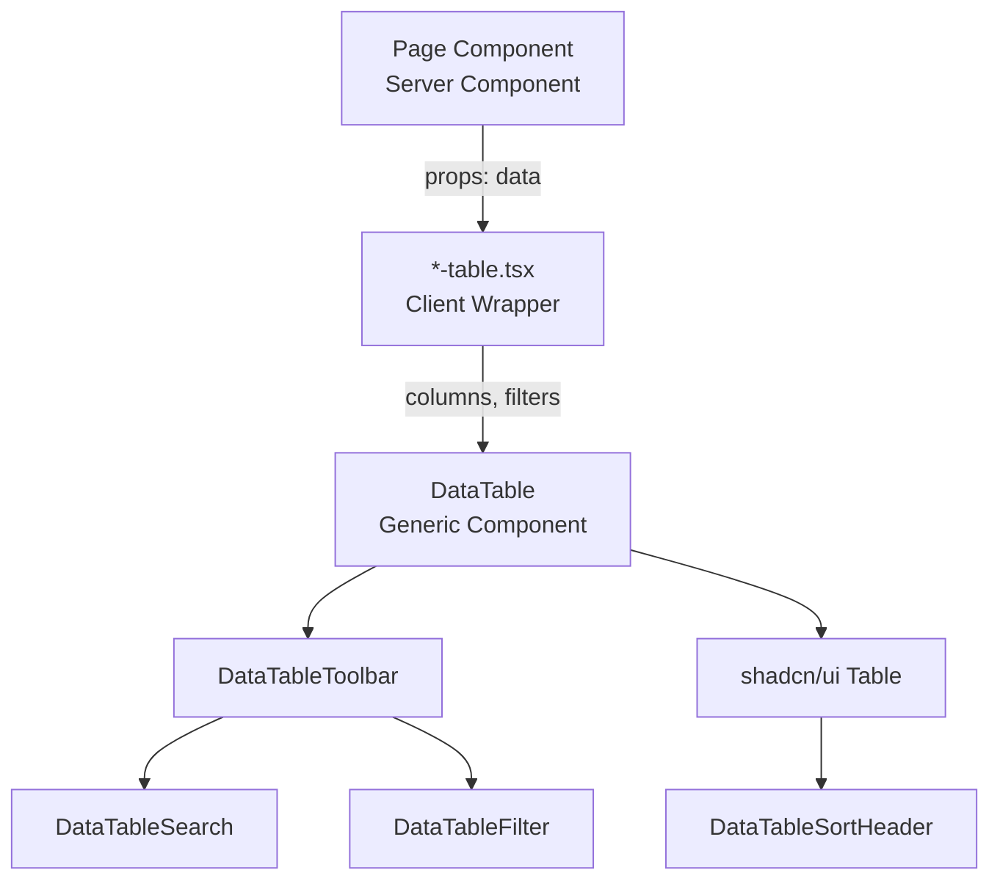
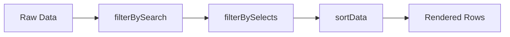

# DataTable Component System

Date: 2026-02-13 | Status: Implemented

## Overview

The DataTable component system provides reusable client-side sorting, filtering, and search functionality across all CRM tables. Built as a generic `DataTable<TData>` component with type-safe column definitions, it handles data transformation through a composable pipeline without external dependencies.

## Key Features

- **Generic type-safe component** for any entity type
- **Client-side processing** for instant UX (small datasets, single user)
- **Three-stage pipeline**: search → filter → sort
- **Cycle sorting**: null → asc → desc → null (returns to original order)
- **Custom filter matching** for computed fields (e.g., stock levels)
- **Nested data accessors** via function accessors for relations
- **Empty state distinction**: "no data" vs "no results"
- **Zero new dependencies** (uses existing shadcn/ui, lucide-react, date-fns)

## Architecture

### Component Hierarchy



### Data Processing Pipeline



**Pipeline implementation** (`src/components/data-table/data-table.tsx:32`):
```typescript
const processedData = useMemo(() => {
  let result = data
  result = filterBySearch(result, columns, searchQuery)
  result = filterBySelects(result, filters, activeFilters)
  result = sortData(result, columns, sortState)
  return result
}, [data, columns, searchQuery, activeFilters, sortState, filters])
```

### Core Components

| Component | Purpose | Location |
|-----------|---------|----------|
| **DataTable** | Main generic table component | `src/components/data-table/data-table.tsx` |
| **types.ts** | TypeScript type definitions | `src/components/data-table/types.ts` |
| **utils.ts** | Pure filter/sort functions | `src/components/data-table/utils.ts` |
| **data-table-toolbar.tsx** | Composes search + filters + count | `src/components/data-table/data-table-toolbar.tsx` |
| **data-table-search.tsx** | Search input with icon | `src/components/data-table/data-table-search.tsx` |
| **data-table-sort.tsx** | Sortable column header with arrows | `src/components/data-table/data-table-sort.tsx` |
| **data-table-filter.tsx** | Select-based dropdown filter | `src/components/data-table/data-table-filter.tsx` |

### Per-Table Wrappers

| Wrapper | Entity | Special Features | Location |
|---------|--------|------------------|----------|
| **OrdersTable** | Order | Status filter, nested OrderStatus component | `src/app/(dashboard)/orders/orders-table.tsx` |
| **InventoryTable** | Ingredient | customMatch for stock levels (low/out) | `src/app/(dashboard)/inventory/inventory-table.tsx` |
| **ClientsTable** | Client | Search + sort only, no filters | `src/app/(dashboard)/clients/clients-table.tsx` |
| **PurchasesTable** | Purchase | Nested ingredient accessor | `src/app/(dashboard)/purchases/purchases-table.tsx` |
| **ProductionTable** | Production | Nested recipe accessor | `src/app/(dashboard)/production/production-table.tsx` |
| **ExpensesTable** | Expense | Category filter | `src/app/(dashboard)/expenses/expenses-table.tsx` |
| **RecipesGrid** | Recipe | Search-only card grid (not DataTable) | `src/app/(dashboard)/recipes/recipes-grid.tsx` |

## TypeScript Types

### ColumnDef<TData>

**Location**: `src/components/data-table/types.ts:25`

```typescript
export type ColumnDef<TData> = {
  key: string                    // Unique column identifier
  header: string                 // Display header text
  accessor: Accessor<TData>      // Property key or function
  cell?: (row: TData) => ReactNode  // Optional custom renderer
  sortable?: boolean             // Enable sorting
  searchable?: boolean           // Include in search
  className?: string             // Cell CSS classes
  headerClassName?: string       // Header CSS classes
}
```

### Accessor<TData>

**Location**: `src/components/data-table/types.ts:23`

```typescript
export type Accessor<TData> =
  | (keyof TData & string)       // Flat property: 'name'
  | ((row: TData) => string | number | null | undefined)  // Nested: (row) => row.client?.name
```

**Examples**:
- Flat: `accessor: 'name'` → accesses `row.name`
- Nested: `accessor: (row) => row.client?.name` → accesses relation
- Joined: `accessor: (row) => row.order_items?.map(i => i.recipe?.name).join(', ')`

### FilterConfig<TData>

**Location**: `src/components/data-table/types.ts:15`

```typescript
export type FilterConfig<TData> = {
  columnKey: string              // Column to filter on
  label: string                  // Filter label
  allLabel: string               // "All" option label
  options: FilterOption[]        // Dropdown options
  customMatch?: (row: TData, filterValue: string) => boolean  // Custom logic
}
```

**customMatch example** (`src/app/(dashboard)/inventory/inventory-table.tsx:46`):
```typescript
customMatch: (row, filterValue) => {
  if (filterValue === 'out') return row.stock_qty <= 0
  if (filterValue === 'low') return row.stock_qty > 0 && row.stock_qty < 100
  return true
}
```

### SortState

**Location**: `src/components/data-table/types.ts:5`

```typescript
export type SortState = {
  key: string                    // Column key being sorted
  direction: SortDirection       // 'asc' | 'desc' | null
}
```

**Sort cycle** (`src/components/data-table/data-table.tsx:40`):
```typescript
function handleSort(columnKey: string) {
  setSortState((prev) => {
    if (!prev || prev.key !== columnKey) return { key: columnKey, direction: 'asc' }
    if (prev.direction === 'asc') return { key: columnKey, direction: 'desc' }
    return null  // Return to original order
  })
}
```

## Core Utilities

### resolveAccessor()

**Location**: `src/components/data-table/utils.ts:3`

**Purpose**: Extracts value from row using flat property or function accessor

```typescript
export function resolveAccessor<TData>(
  accessor: Accessor<TData>,
  row: TData
): string | number | null | undefined
```

**Behavior**:
- Function accessor: Calls `accessor(row)` directly
- String accessor: Returns `row[accessor]`
- Null safety: Returns `null` for undefined/null
- Type coercion: Converts non-string/number values to string

### filterBySearch()

**Location**: `src/components/data-table/utils.ts:16`

**Purpose**: Filters rows by search query across searchable columns

```typescript
export function filterBySearch<TData>(
  data: TData[],
  columns: ColumnDef<TData>[],
  query: string
): TData[]
```

**Algorithm**:
1. Trim and lowercase query
2. Find columns marked `searchable: true`
3. Keep row if ANY searchable column contains query (case-insensitive)
4. Return original data if query empty

### filterBySelects()

**Location**: `src/components/data-table/utils.ts:35`

**Purpose**: Filters rows by active select filters

```typescript
export function filterBySelects<TData>(
  data: TData[],
  filters: FilterConfig<TData>[],
  activeFilters: Record<string, string>
): TData[]
```

**Algorithm**:
1. Skip empty/undefined filter values
2. For each active filter:
   - Use `customMatch()` if defined
   - Otherwise match `String(row[columnKey]) === filterValue`
3. Keep row if ALL active filters match (AND logic)

### sortData()

**Location**: `src/components/data-table/utils.ts:55`

**Purpose**: Sorts rows by column accessor

```typescript
export function sortData<TData>(
  data: TData[],
  columns: ColumnDef<TData>[],
  sortState: SortState | null
): TData[]
```

**Algorithm**:
1. Return original if `sortState` is null
2. Resolve both values using accessor
3. Nulls sorted last
4. Auto-detect comparison strategy:
   - Date strings (`YYYY-MM-DD*`): Parse and compare timestamps
   - Numbers: Numeric comparison
   - Strings: `localeCompare('ru')`
5. Reverse for `desc` direction

**Date detection** (`src/components/data-table/utils.ts:76`):
```typescript
if (typeof aVal === 'string' && typeof bVal === 'string' &&
    /^\d{4}-\d{2}-\d{2}/.test(aVal) && /^\d{4}-\d{2}-\d{2}/.test(bVal)) {
  comparison = new Date(aVal).getTime() - new Date(bVal).getTime()
}
```

## Implementation Guide

### Step 1: Create Table Wrapper

**File**: `src/app/(dashboard)/[entity]/[entity]-table.tsx`

```typescript
'use client'

import { DataTable } from '@/components/data-table/data-table'
import type { Entity } from '@/lib/types'
import type { ColumnDef, FilterConfig } from '@/components/data-table/types'

// Define columns
const columns: ColumnDef<Entity>[] = [
  {
    key: 'name',
    header: 'Название',
    accessor: 'name',          // Flat property
    searchable: true,
    sortable: true,
  },
  {
    key: 'category',
    header: 'Категория',
    accessor: (row) => row.category?.name ?? null,  // Nested relation
    sortable: true,
  },
  {
    key: 'amount',
    header: 'Сумма',
    accessor: 'amount',
    sortable: true,
    cell: (row) => `${row.amount} ₽`,  // Custom rendering
  },
]

// Optional: Define filters
const categoryFilter: FilterConfig<Entity> = {
  columnKey: 'category_id',
  label: 'Категория',
  allLabel: 'Все категории',
  options: [
    { value: '1', label: 'Категория 1' },
    { value: '2', label: 'Категория 2' },
  ],
}

interface EntityTableProps {
  entities: Entity[]
}

export function EntityTable({ entities }: EntityTableProps) {
  return (
    <DataTable
      data={entities}
      columns={columns}
      filters={[categoryFilter]}
      searchPlaceholder="Поиск..."
      noDataMessage="Нет данных"
      emptyMessage="Ничего не найдено"
      getRowId={(row) => row.id}
    />
  )
}
```

### Step 2: Use in Server Component Page

**File**: `src/app/(dashboard)/[entity]/page.tsx`

```typescript
import { EntityTable } from './entity-table'
import { getEntities } from '@/lib/actions/entity'

export default async function EntityPage() {
  const entities = await getEntities()

  return (
    <div className="container mx-auto py-6">
      <h1 className="text-2xl font-bold mb-4">Entities</h1>
      <EntityTable entities={entities} />
    </div>
  )
}
```

### Step 3: Custom Filter Matching (Optional)

For computed or range-based filters:

```typescript
const stockFilter: FilterConfig<Ingredient> = {
  columnKey: 'stock_qty',
  label: 'Остаток',
  allLabel: 'Все',
  options: [
    { value: 'low', label: 'Мало (< 100)' },
    { value: 'out', label: 'Нет в наличии' },
  ],
  customMatch: (row, filterValue) => {
    if (filterValue === 'out') return row.stock_qty <= 0
    if (filterValue === 'low') return row.stock_qty > 0 && row.stock_qty < 100
    return true
  },
}
```

### Step 4: Custom Cell Rendering

For complex UI (badges, buttons, nested components):

```typescript
{
  key: 'status',
  header: 'Статус',
  accessor: 'status',
  cell: (row) => <OrderStatus orderId={row.id} currentStatus={row.status} />,
}
```

**Note**: Client components in `cell` are allowed because the wrapper is `'use client'`.

## Example: Orders Table

**Location**: `src/app/(dashboard)/orders/orders-table.tsx`

```typescript
const columns: ColumnDef<Order>[] = [
  {
    key: 'date',
    header: 'Дата',
    accessor: 'date',
    sortable: true,
    cell: (row) => format(new Date(row.date), 'd MMM yyyy', { locale: ru }),
  },
  {
    key: 'client',
    header: 'Клиент',
    accessor: (row) => row.client?.name ?? null,  // Nested accessor
    searchable: true,
    sortable: true,
  },
  {
    key: 'items',
    header: 'Позиции',
    accessor: (row) => row.order_items?.map(i => i.recipe?.name).join(', ') ?? '',
    searchable: true,
    cell: (row) => (
      <div>
        {row.order_items?.map((item) => (
          <div key={item.id}>{item.recipe?.name} x{item.quantity}</div>
        ))}
      </div>
    ),
  },
  {
    key: 'status',
    header: 'Статус',
    accessor: 'status',
    cell: (row) => <OrderStatus orderId={row.id} currentStatus={row.status} />,
  },
]

const statusFilter: FilterConfig<Order> = {
  columnKey: 'status',
  label: 'Статус',
  allLabel: 'Все статусы',
  options: [
    { value: 'new', label: 'Новый' },
    { value: 'in_progress', label: 'В работе' },
    { value: 'ready', label: 'Готов' },
    { value: 'delivered', label: 'Выдан' },
    { value: 'cancelled', label: 'Отменён' },
  ],
}
```

## Design Decisions

### ADR: Client-Side vs Server-Side Processing

**Context**: Need filtering/sorting for 7 tables with small datasets (< 1000 rows each, single user)

**Decision**: Client-side processing with React state and useMemo

**Consequences**:
- ✅ Instant UX (no network round-trips)
- ✅ Simple implementation (no URL state, no server action complexity)
- ✅ Works with existing Server Components pattern
- ✅ Sufficient for single-user CRM with small datasets
- ⚠️ Does not scale to 10,000+ rows (not needed for this use case)
- ⚠️ Filter/sort state not preserved in URL (acceptable for dashboard tables)

### ADR: Custom Solution vs TanStack Table

**Context**: Need generic table component with sorting/filtering

**Decision**: Build custom lightweight solution

**Consequences**:
- ✅ Zero new dependencies
- ✅ Full control over UX (3-cycle sort, custom filters)
- ✅ Type-safe with minimal boilerplate
- ✅ Simpler mental model for project
- ⚠️ No advanced features (pagination, row selection, column resizing)
- ⚠️ Manual maintenance vs battle-tested library

### ADR: Sort Cycle Design

**Context**: Clicked column header should toggle sort direction

**Decision**: Cycle: null → asc → desc → null

**Consequences**:
- ✅ User can return to original order (server-provided order)
- ✅ Predictable 3-click pattern
- ✅ Visual arrow indicators match behavior
- ⚠️ Requires null state handling in sort logic

### ADR: Empty State Distinction

**Context**: Empty table could mean "no data" or "no results after filtering"

**Decision**: Different messages based on data.length

```typescript
{data.length === 0 ? noDataMessage : emptyMessage}
```

**Consequences**:
- ✅ Clear user feedback ("нет заказов" vs "заказы не найдены")
- ✅ Encourages users to clear filters when appropriate
- ✅ No extra state needed (derived from data.length)

## Performance Characteristics

### Complexity
- **Search**: O(n × m) where n = rows, m = searchable columns
- **Filter**: O(n × f) where f = active filters
- **Sort**: O(n log n) for each sort operation
- **Total**: O(n × m + n × f + n log n) per render

### Optimization Strategy
- `useMemo` prevents recomputation unless dependencies change
- Pure functions (`utils.ts`) enable easy memoization
- No virtual scrolling (not needed for < 1000 rows)

### Tested Dataset Sizes
| Table | Typical Rows | Performance |
|-------|--------------|-------------|
| Orders | 50-200 | Instant |
| Inventory | 10-30 | Instant |
| Purchases | 100-500 | Instant |
| Clients | 20-100 | Instant |
| Production | 50-200 | Instant |
| Expenses | 50-200 | Instant |
| Recipes | 5-20 | Instant |

**Bottleneck**: Would become noticeable at ~5000+ rows (not expected in single-user CRM)

## Accessibility

- **Keyboard navigation**: Arrow indicators have `aria-sort` attributes
- **Screen readers**: Column headers announce sort state
- **Focus management**: Search input and filters are keyboard accessible
- **Semantic HTML**: Uses `<table>`, `<th>`, `<td>` with proper ARIA

## Edge Cases Handled

1. **Null/undefined values**: Sorted last, displayed as "—"
2. **Deleted relations**: Accessor returns null, cell shows "—"
3. **Empty search**: Returns full dataset (no filter applied)
4. **No searchable columns**: Toolbar hides search input
5. **No filters**: Toolbar hides filter dropdowns
6. **Multiple active filters**: AND logic (all must match)
7. **Sort on filtered data**: Sort applies after filter pipeline
8. **Date string detection**: Auto-detects YYYY-MM-DD format for sorting

## Testing Checklist

- [ ] Search finds rows across all searchable columns
- [ ] Search is case-insensitive
- [ ] Filters reduce result count (shown in toolbar)
- [ ] Multiple filters combine with AND logic
- [ ] customMatch filters work correctly
- [ ] Sort cycles through null → asc → desc → null
- [ ] Sort works with dates (YYYY-MM-DD)
- [ ] Sort works with numbers
- [ ] Sort works with text (Russian locale)
- [ ] Nulls appear last in sorted results
- [ ] Empty state shows "no data" when data.length === 0
- [ ] Empty state shows "no results" when filtered to zero
- [ ] Cell renderers display custom components
- [ ] Nested accessors resolve correctly
- [ ] Toolbar hides when no search/filters
- [ ] getRowId produces unique keys

## Known Limitations

1. **No pagination**: All rows rendered at once (acceptable for < 1000 rows)
2. **No column reordering**: Fixed column order from definition
3. **No column hiding**: All columns always visible
4. **No row selection**: Cannot select multiple rows
5. **No state persistence**: Filter/sort state lost on page refresh
6. **No server-side filtering**: All data loaded upfront

## Future Enhancements

- Add pagination for large datasets (if needed)
- URL state persistence for filters/sort (for shareable links)
- Export to CSV with current filters applied
- Column visibility toggles
- Multi-column sorting
- Saved filter presets
- Virtual scrolling for 5000+ rows
- Dark mode optimized colors

## Related Documentation

- [Database Schema](../architecture/database-schema.md) - Entity structure and relations
- [shadcn/ui Table](https://ui.shadcn.com/docs/components/table) - Base table component
- [Next.js App Router](https://nextjs.org/docs/app) - Server/Client Component pattern

## Files Structure

```
src/components/data-table/
├── types.ts                    # TypeScript type definitions
├── utils.ts                    # Pure filter/sort functions
├── data-table.tsx              # Main DataTable component
├── data-table-toolbar.tsx      # Toolbar with search + filters
├── data-table-search.tsx       # Search input
├── data-table-sort.tsx         # Sortable column header
└── data-table-filter.tsx       # Select dropdown filter

src/app/(dashboard)/
├── orders/orders-table.tsx
├── inventory/inventory-table.tsx
├── clients/clients-table.tsx
├── purchases/purchases-table.tsx
├── production/production-table.tsx
├── expenses/expenses-table.tsx
└── recipes/recipes-grid.tsx    # Non-DataTable variant
```

## Modified Pages

All 7 dashboard pages now use table wrappers:
- `src/app/(dashboard)/orders/page.tsx` → `<OrdersTable />`
- `src/app/(dashboard)/inventory/page.tsx` → `<InventoryTable />`
- `src/app/(dashboard)/clients/page.tsx` → `<ClientsTable />`
- `src/app/(dashboard)/purchases/page.tsx` → `<PurchasesTable />`
- `src/app/(dashboard)/production/page.tsx` → `<ProductionTable />`
- `src/app/(dashboard)/expenses/page.tsx` → `<ExpensesTable />`
- `src/app/(dashboard)/recipes/page.tsx` → `<RecipesGrid />`

## References

- [React useMemo](https://react.dev/reference/react/useMemo) - Memoization strategy
- [TypeScript Generics](https://www.typescriptlang.org/docs/handbook/2/generics.html) - Generic component pattern
- [date-fns format](https://date-fns.org/v3.3.1/docs/format) - Date formatting in cells
- [Radix UI Select](https://www.radix-ui.com/primitives/docs/components/select) - Filter dropdowns
