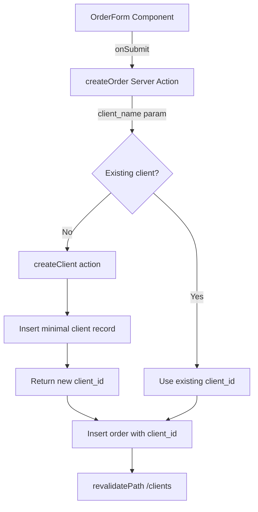

# Order Form Enhancements
Date: 2026-02-13 | Status: Implemented

## Overview

Three user experience improvements to the order creation form that streamline the order entry workflow: searchable client selection with auto-creation, quick date pickers, and recipe default pricing.

## Key Features

### 1. Client Combobox with Auto-Creation
- **Before**: Simple dropdown select requiring users to scroll through all clients
- **After**: Searchable combobox with real-time filtering and new client creation
- Users can type to search existing clients or enter a new client name
- If the name doesn't match an existing client, a new client record is auto-created when the order is submitted
- No need to leave the order form to create a client first

### 2. Quick Date Selection Buttons
- **Before**: Users had to manually open date picker and navigate to date
- **After**: One-click buttons for common dates: "Сегодня" (Today), "Завтра" (Tomorrow), "Послезавтра" (Day after tomorrow)
- Buttons set the date instantly while still allowing manual date picker selection
- Improves speed for same-day and next-day orders

### 3. Recipe Default Price Auto-Fill
- **Before**: Users had to manually enter price for every order item
- **After**: Recipes can have an optional default price that auto-fills when selected
- Users can still override the auto-filled price if needed
- Reduces repetitive data entry for standard-priced items

## Architecture

### Client Auto-Creation Flow



**Key Design Decisions:**
- Client auto-creation happens server-side in the `createOrder` action for transactional safety
- Only requires `name` field — minimal record to preserve FK integrity on `orders.client_id`
- Revalidates both `/orders` and `/clients` paths after creation
- Search is case-insensitive partial match on client name

**Files:**
- Action: `src/lib/actions/orders.ts` — `createOrder()` function
- Component: `src/app/(dashboard)/orders/order-form.tsx` — Combobox UI

### Combobox Implementation

Uses shadcn/ui Command + Popover pattern:

```tsx
<Popover>
  <PopoverTrigger asChild>
    <Button variant="outline" role="combobox">
      {selectedClient?.name || "Выберите клиента"}
    </Button>
  </PopoverTrigger>
  <PopoverContent>
    <Command shouldFilter={false}> {/* Manual filtering */}
      <CommandInput onValueChange={setClientSearch} />
      <CommandList>
        {filteredClients.map(client => (
          <CommandItem onSelect={() => setSelectedClient(client)}>
            {client.name}
          </CommandItem>
        ))}
        {clientSearch && filteredClients.length === 0 && (
          <CommandEmpty>
            Создать нового клиента "{clientSearch}"
          </CommandEmpty>
        )}
      </CommandList>
    </Command>
  </PopoverContent>
</Popover>
```

**Technical Notes:**
- `shouldFilter={false}` — disables built-in filtering to support "new client" empty state
- Manual filtering via `filteredClients = clients.filter(c => c.name.toLowerCase().includes(search.toLowerCase()))`
- Hidden input (`client_name`) passes search term to server action for auto-creation

**Files:**
- Component: `src/app/(dashboard)/orders/order-form.tsx` — lines ~50-120

### Recipe Default Price

**Database Change:**
```sql
-- Added to recipes table in supabase/schema.sql
ALTER TABLE recipes ADD COLUMN price numeric DEFAULT NULL;
```

**Type Update:**
```typescript
// src/lib/types.ts
export interface Recipe {
  id: string;
  name: string;
  price: number | null; // <-- Added
  // ...
}
```

**Auto-Fill Logic:**
```tsx
// src/app/(dashboard)/orders/order-form.tsx
const handleRecipeChange = (recipeId: string) => {
  const selectedRecipe = recipes.find(r => r.id === recipeId);
  if (selectedRecipe?.price) {
    form.setValue('price', selectedRecipe.price.toString());
  }
};
```

**Files:**
- Schema: `supabase/schema.sql` — recipes table
- Types: `src/lib/types.ts` — Recipe interface
- Action: `src/lib/actions/recipes.ts` — `createRecipe()` accepts optional price param
- Component: `src/app/(dashboard)/recipes/recipe-form.tsx` — price input field
- Component: `src/app/(dashboard)/orders/order-form.tsx` — auto-fill logic

### Quick Date Buttons

```tsx
<div className="flex gap-2">
  <Button type="button" variant="outline" onClick={() => setDate(new Date())}>
    Сегодня
  </Button>
  <Button type="button" variant="outline" onClick={() => setDate(addDays(new Date(), 1))}>
    Завтра
  </Button>
  <Button type="button" variant="outline" onClick={() => setDate(addDays(new Date(), 2))}>
    Послезавтра
  </Button>
</div>
<Popover>
  <PopoverTrigger asChild>
    <Button variant="outline">
      {date ? format(date, 'PPP', { locale: ru }) : 'Выберите дату'}
    </Button>
  </PopoverTrigger>
  <PopoverContent>
    <Calendar mode="single" selected={date} onSelect={setDate} />
  </PopoverContent>
</Popover>
```

**Technical Notes:**
- Uses `date-fns` `addDays()` for date arithmetic
- `type="button"` prevents form submission on click
- Date state managed by `react-hook-form` `Controller` component
- Russian locale (`ru` from `date-fns/locale`) for date formatting

**Files:**
- Component: `src/app/(dashboard)/orders/order-form.tsx` — lines ~180-220

## Code References

### Modified Files

1. **Database Schema** — `/home/nolood/general/crm/supabase/schema.sql`
   - Added `price numeric default null` to recipes table

2. **Type Definitions** — `/home/nolood/general/crm/src/lib/types.ts`
   - Added `price: number | null` to Recipe type

3. **Recipe Actions** — `/home/nolood/general/crm/src/lib/actions/recipes.ts`
   - Updated `createRecipe()` to accept optional `price` parameter
   - Passes price to database insert

4. **Order Actions** — `/home/nolood/general/crm/src/lib/actions/orders.ts`
   - Updated `createOrder()` to accept `client_name` parameter
   - Auto-creates client if name doesn't match existing client
   - Revalidates `/clients` path after client creation

5. **Order Form Component** — `/home/nolood/general/crm/src/app/(dashboard)/orders/order-form.tsx`
   - Replaced Select with Command + Popover combobox for clients
   - Added client search state and filtering logic
   - Added quick date buttons (Сегодня, Завтра, Послезавтра)
   - Added recipe price auto-fill on recipe selection
   - Added hidden `client_name` input for auto-creation flow

6. **Recipe Form Component** — `/home/nolood/general/crm/src/app/(dashboard)/recipes/recipe-form.tsx`
   - Added optional price input field
   - Uses number input with `step="0.01"` for currency

## User Impact

### Client Selection
- **Before**: 4 clicks minimum (open dropdown → scroll → click client → submit)
- **After**: 2 clicks (type to search → select) OR auto-create new client inline

### Date Selection
- **Before**: 3+ clicks (open calendar → navigate month → click date)
- **After**: 1 click for today/tomorrow/day-after-tomorrow

### Order Item Pricing
- **Before**: Manual price entry for every line item
- **After**: Auto-filled from recipe default (editable if needed)

### Combined Workflow Improvement
Creating a standard order with 3 items:
- **Before**: ~15 clicks + manual typing for all prices
- **After**: ~8 clicks + minimal typing (only if overriding defaults)

## Related Documentation

- [Database Schema](../architecture/database-schema.md) — recipes and orders tables
- [CLAUDE.md](../../CLAUDE.md) — Server Actions pattern, Supabase integration

## Future Enhancements

Potential improvements based on this foundation:
- Client combobox could show recent clients first
- Date buttons could be configurable (e.g., +3 days, +7 days)
- Recipe default price could sync with latest order item price
- Bulk price update for all recipes
