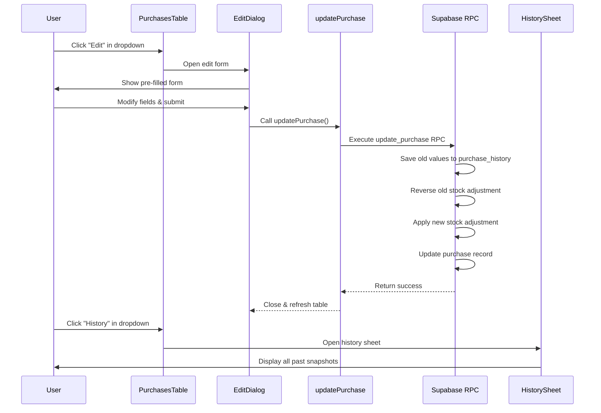

# Purchase Edit with History

Date: 2026-02-13 | Status: Implemented

## Overview

The Purchase Edit with History feature enables users to modify purchase records on the `/purchases` page while maintaining a complete audit trail. Every edit operation automatically saves a snapshot of the previous values to a dedicated history table before applying changes. The feature also ensures atomic stock adjustments across multiple ingredients.

## Key Features

- **Edit purchases** via action dropdown menu on purchases table
- **View full edit history** for any purchase via side sheet panel
- **Atomic stock adjustments** when ingredient or amount changes
- **Historical snapshots** preserve all field values for audit compliance
- **Graceful handling** of deleted ingredients in history display

## User Flow



## Architecture

### Components

| Component | Purpose | Location | Type |
|-----------|---------|----------|------|
| **PurchasesTable** | Main table with action dropdown per row | `src/app/(dashboard)/purchases/purchases-table.tsx` | Client |
| **PurchaseEditDialog** | Edit form in modal dialog | `src/app/(dashboard)/purchases/purchase-edit-dialog.tsx` | Client |
| **PurchaseHistorySheet** | History display in side panel | `src/app/(dashboard)/purchases/purchase-history-sheet.tsx` | Client |

### Data Flow

1. **User initiates edit** → `PurchasesTable:42` (action dropdown)
2. **Dialog opens** → `PurchaseEditDialog:28` (loads current values)
3. **Form submitted** → `PurchaseEditDialog:89` (calls server action)
4. **Server action** → `src/lib/actions/purchases.ts:updatePurchase()` (line 83)
5. **RPC function** → `supabase/schema.sql:update_purchase()` (line 182)
   - Saves snapshot to `purchase_history` table
   - Reverses old ingredient stock: `UPDATE ingredients SET stock = stock - OLD.amount_kg`
   - Applies new ingredient stock: `UPDATE ingredients SET stock = stock + NEW.amount_kg`
   - Updates purchase record
6. **Revalidation** → Next.js revalidates `/purchases` page cache
7. **Table refreshes** → Shows updated purchase

### Database Schema

#### purchase_history table

```sql
CREATE TABLE IF NOT EXISTS purchase_history (
  id BIGSERIAL PRIMARY KEY,
  purchase_id BIGINT NOT NULL REFERENCES purchases(id) ON DELETE CASCADE,
  old_ingredient_id BIGINT,
  old_supplier TEXT,
  old_amount_kg DECIMAL(10,2),
  old_price_per_kg DECIMAL(10,2),
  old_total_cost DECIMAL(10,2),
  old_purchase_date DATE,
  old_notes TEXT,
  edited_by UUID REFERENCES auth.users(id) ON DELETE SET NULL,
  edited_at TIMESTAMPTZ DEFAULT NOW()
);
```

**Design decisions**:
- **ON DELETE CASCADE**: When purchase deleted, its history is also deleted
- **old_ingredient_id without FK**: Preserves ingredient ID even if ingredient deleted
- **edited_by nullable**: History preserved even if user account deleted
- **All old_* fields**: Full snapshot approach (not field-level changelog)

#### update_purchase RPC function

Located at `supabase/schema.sql:182`

```sql
CREATE OR REPLACE FUNCTION update_purchase(
  p_id BIGINT,
  p_ingredient_id BIGINT,
  p_supplier TEXT,
  p_amount_kg DECIMAL,
  p_price_per_kg DECIMAL,
  p_total_cost DECIMAL,
  p_purchase_date DATE,
  p_notes TEXT,
  p_edited_by UUID
)
RETURNS void
LANGUAGE plpgsql
SECURITY DEFINER
```

**Transaction flow**:
1. Check RLS: Verify user has UPDATE permission
2. Save snapshot: INSERT INTO purchase_history (old values)
3. Stock reversal: Subtract old amount from old ingredient
4. Stock application: Add new amount to new ingredient
5. Update record: Apply all new values to purchase

**Atomicity guarantee**: All operations in single transaction (rollback on any failure)

## Server Actions

### updatePurchase()

**Location**: `src/lib/actions/purchases.ts:83`

```typescript
export async function updatePurchase(
  id: number,
  data: PurchaseFormData
): Promise<{ success: boolean; error?: string }>
```

**Input validation**:
- `id`: Purchase ID (number)
- `data.ingredientId`: Valid ingredient ID
- `data.supplier`: Non-empty string
- `data.amountKg`: Positive decimal
- `data.pricePerKg`: Positive decimal
- `data.totalCost`: Positive decimal
- `data.purchaseDate`: Valid date string
- `data.notes`: Optional text

**Error handling**:
- Returns `{ success: false, error: "message" }` on validation/DB errors
- Catches and logs all exceptions
- Revalidates path only on success

### getPurchaseHistory()

**Location**: `src/lib/actions/purchases.ts:128`

```typescript
export async function getPurchaseHistory(
  purchaseId: number
): Promise<PurchaseHistory[]>
```

**Query details**:
- LEFT JOIN with ingredients table to resolve old_ingredient_id
- Falls back to "(удалён)" if ingredient was deleted
- Orders by `edited_at DESC` (newest first)
- Returns complete history array

## TypeScript Types

**Location**: `src/lib/types.ts:62`

```typescript
export interface PurchaseHistory {
  id: number
  purchase_id: number
  old_ingredient_id: number | null
  old_ingredient_name?: string
  old_supplier: string | null
  old_amount_kg: number | null
  old_price_per_kg: number | null
  old_total_cost: number | null
  old_purchase_date: string | null
  old_notes: string | null
  edited_by: string | null
  edited_at: string
}
```

**Key fields**:
- `old_ingredient_name`: Populated by LEFT JOIN in query (not stored in DB)
- Nullable fields: Handle deleted references gracefully

## UI Components

### PurchasesTable

**Location**: `src/app/(dashboard)/purchases/purchases-table.tsx`

**Features**:
- Server-side data fetching with Supabase client
- Action dropdown per row (Edit, History)
- Pagination support
- Responsive design with Tailwind

**Key code**:
```typescript
<DropdownMenuItem onSelect={() => {
  setSelectedPurchase(purchase)
  setIsEditOpen(true)
}}>
  <Pencil className="mr-2 h-4 w-4" />
  Редактировать
</DropdownMenuItem>
```

### PurchaseEditDialog

**Location**: `src/app/(dashboard)/purchases/purchase-edit-dialog.tsx`

**Features**:
- Pre-filled form with current values
- Loading state with disabled inputs during submission
- Optimistic UI updates
- Error toast notifications
- Ingredient dropdown with search

**Form structure**:
```typescript
const [formData, setFormData] = useState<PurchaseFormData>({
  ingredientId: purchase.ingredient_id,
  supplier: purchase.supplier,
  amountKg: purchase.amount_kg,
  pricePerKg: purchase.price_per_kg,
  totalCost: purchase.total_cost,
  purchaseDate: purchase.purchase_date,
  notes: purchase.notes || '',
})
```

**Submission handling**:
```typescript
const result = await updatePurchase(purchase.id, formData)
if (result.success) {
  onClose()
  toast({ title: "Закупка обновлена" })
} else {
  toast({ title: "Ошибка", description: result.error, variant: "destructive" })
}
```

### PurchaseHistorySheet

**Location**: `src/app/(dashboard)/purchases/purchase-history-sheet.tsx`

**Features**:
- Side panel overlay (shadcn Sheet component)
- Chronological list of all edits (newest first)
- Formatted dates and numbers
- Handles deleted ingredients with "(удалён)" label
- Empty state for no history

**History item display**:
```typescript
{history.map((item) => (
  <div key={item.id} className="border-b pb-4">
    <div className="text-sm text-muted-foreground">
      {new Date(item.edited_at).toLocaleString('ru-RU')}
    </div>
    <div className="mt-2 space-y-1 text-sm">
      <div>Ингредиент: {item.old_ingredient_name || '(удалён)'}</div>
      <div>Поставщик: {item.old_supplier}</div>
      {/* ... more fields ... */}
    </div>
  </div>
))}
```

## Security (RLS)

### Row-Level Security Policies

**Location**: `supabase/schema.sql:141`

```sql
-- UPDATE policy for purchases
CREATE POLICY "Users can update purchases"
  ON purchases FOR UPDATE
  USING (true)
  WITH CHECK (true);
```

**Why SECURITY DEFINER**: The `update_purchase` RPC function runs with elevated privileges to:
1. Insert into purchase_history (user may not have direct INSERT on this table)
2. Update ingredients.stock (user may not have UPDATE on ingredients)
3. Maintain atomicity across multiple table operations

**RLS verification**: RPC function checks user's UPDATE permission on purchases before proceeding

## Testing Checklist

- [ ] Edit purchase with same ingredient (stock delta = 0)
- [ ] Edit purchase with different ingredient (stock transfers)
- [ ] Edit purchase amount (stock adjusts on same ingredient)
- [ ] View history after multiple edits
- [ ] History displays deleted ingredient as "(удалён)"
- [ ] Submit button disables during loading
- [ ] Error toast on validation failure
- [ ] Error toast on RLS permission failure
- [ ] Page revalidates and shows updated data
- [ ] History sheet scrolls with many entries

## Known Limitations

1. **No field-level changelog**: Cannot see which specific field changed between versions (full snapshot only)
2. **History deleted with purchase**: If purchase deleted, history is cascade-deleted (no orphaned history)
3. **No rollback feature**: Users cannot revert to previous version (read-only history)
4. **No diff view**: UI shows snapshots separately, no side-by-side comparison

## Future Enhancements

- Add rollback/restore functionality to revert to historical version
- Implement field-level diff highlighting in history sheet
- Add export history as CSV/PDF for compliance reporting
- Show "changed by" user name instead of UUID
- Add search/filter in history sheet
- Implement soft delete for purchases to preserve history longer

## Related Documentation

- [001. Fix Double Expense Submission](../decisions/001-fix-double-expense-submission.md) - Similar pattern with form submission
- Supabase schema: `supabase/schema.sql`
- Server actions: `src/lib/actions/purchases.ts`
- TypeScript types: `src/lib/types.ts`

## Files Changed

### New Files
- `src/app/(dashboard)/purchases/purchases-table.tsx` - Client table component
- `src/app/(dashboard)/purchases/purchase-edit-dialog.tsx` - Edit form dialog
- `src/app/(dashboard)/purchases/purchase-history-sheet.tsx` - History side panel

### Modified Files
- `supabase/schema.sql` - Added purchase_history table, UPDATE RLS policy, update_purchase RPC
- `src/lib/types.ts` - Added PurchaseHistory interface
- `src/lib/actions/purchases.ts` - Added updatePurchase() and getPurchaseHistory() actions
- `src/app/(dashboard)/purchases/page.tsx` - Simplified to use PurchasesTable component

## References

- [Supabase RLS Documentation](https://supabase.com/docs/guides/auth/row-level-security)
- [Supabase Functions (SECURITY DEFINER)](https://supabase.com/docs/guides/database/functions)
- [shadcn/ui Dialog](https://ui.shadcn.com/docs/components/dialog)
- [shadcn/ui Sheet](https://ui.shadcn.com/docs/components/sheet)
- [Next.js Server Actions](https://nextjs.org/docs/app/building-your-application/data-fetching/server-actions-and-mutations)
